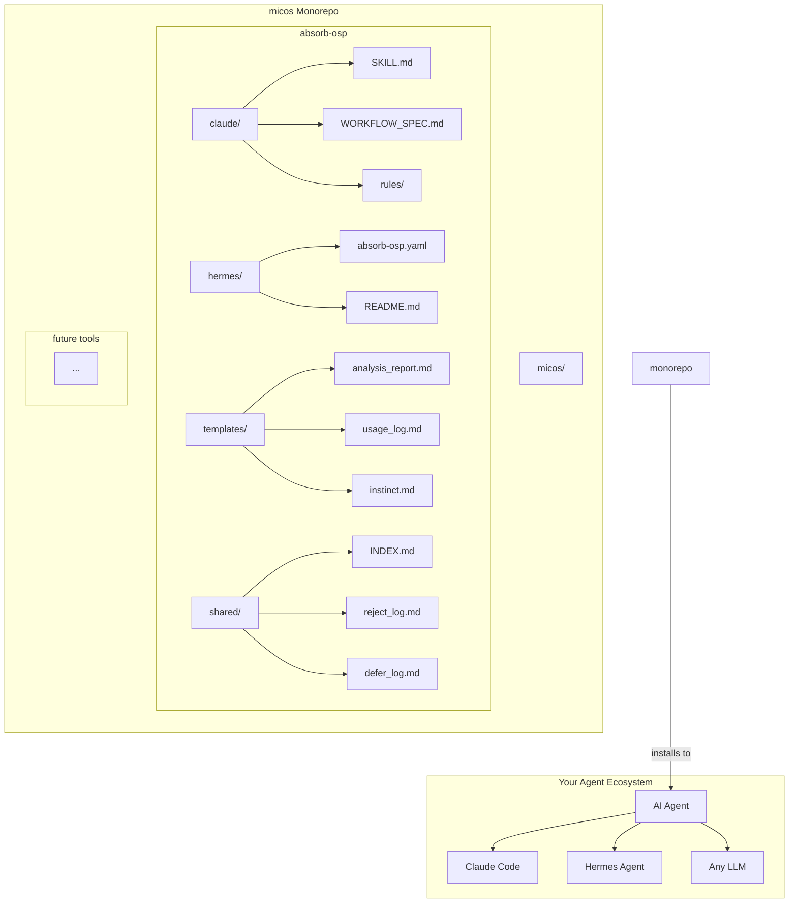
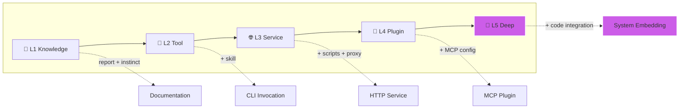

<!--
╔═══════════════════════════════════════════════════════════════╗
║                                                              ║
║   ███╗   ███╗██████╗  ██████╗  ██████╗ ███████╗             ║
║   ████╗ ████║██╔══██╗██╔════╝ ██╔═══╝ ██╔════╝             ║
║   ██╔████╔██║██████╔╝██║  ███╗██║     ███████╗             ║
║   ██║╚██╔╝██║██╔══██╗██║   ██║██║     ╚════██║             ║
║   ██║ ╚═╝ ██║██║  ██║╚██████╔╝╚██████╗███████║             ║
║   ╚═╝     ╚═╝╚═╝  ╚═╝ ╚═════╝  ╚═════╝╚══════╝             ║
║                                                              ║
║   ╔═╗┬─┐┌┐┌┌─┐┬ ┬┌─┐┌┬┐┌─┐ ┌─┐┌─┐┬─┐┌─┐┌┐┌┌┬┐┌─┐┬─┐      ║
║   ╠═╣├┬┘├┴┐├┤ └┬┘├─┘ ││└─┐ ├┤ │ │├┬┘├┤ │││ │ ├┤ ├┬┘      ║
║   ╩ ╩┴└─└─┘└─┘ ┴ ┴  ─┴┘└─┘ └  └─┘┴└─└─┘┘└┘ ┴ └─┘┴└─      ║
║                                                              ║
╚═══════════════════════════════════════════════════════════════╝
-->

# 🪐 micos — 微观开源 · 汇聚智慧

<b>mic</b>roscopic <b>o</b>pen <b>s</b>ource — 让每个 AI Agent 都拥有吸收开源项目精华的能力。

<p align="center">
  
  
  
  
  
  
</p>

---

<p align="center">
  <a href="#-english">English</a> •
  <a href="#-中文">中文</a> •
  <a href="#-português">Português</a> •
  <a href="#-العربية">العربية</a>
</p>

---

<br>

# 🌍 English

<p align="center">
  <em>Bridging open-source innovation with AI agent intelligence.</em>
</p>

## 📋 Overview

**micos** is an open-source collection of **AI agent workflow tools** purpose-built for one mission: **systematically evaluating, absorbing, internalizing, and evolving open-source projects into your local AI ecosystem.**

Born from the practical need to move beyond passive `git clone`, micos provides a disciplined, security-first, spec-driven methodology — turning every open-source project your agent encounters from a mere download into a **permanently integrated capability.**

### 🎯 What micos Solves

| Problem | micos Solution |
|---------|----------------|
| Agents blindly clone and run unknown code | 🔒 **Security triage** — 30-second red-flag scan before any code executes |
| Knowledge lost between sessions | 🧠 **Permanent memory sync** — every absorption logged, indexed, and persisted |
| Same project absorbed multiple times | 🔍 **Deduplication** — automatic merge classification |
| No standard absorption depth | 📊 **5-level depth system** — from L1 knowledge to L5 deep integration |
| Agent framework lock-in | 🔌 **Multi-framework** — Claude Code + Hermes Agent + Any LLM |

---

## 🏛️ Architecture

### Ecosystem Structure



### Absorption Flywheel

```mermaid
flowchart LR
    T0((0)) -->|Trigger| T1((1))
    T1 -->|Triage| T2((2))
    T2 -->|Verify| T3((3))
    T3 -->|Evaluate| T4((4))
    T4 -->|Judge| T5((5))
    T5 -->|Classify| T6((6))
    T6 -->|Internalize| T7((7))
    T7 -->|Load| T8((8))
    T8 -->|Integrate| T9((9))
    T9 -->|Verify| T10((10))
    T10 -->|Sync| T11((11))
    T11 -->|Iterate| T12((12))
    T12 -.->|Evolve| T0
    
    style T0 fill:#4a9eff,stroke:#fff,stroke-width:2px
    style T1 fill:#ff6b6b,stroke:#fff,stroke-width:2px
    style T6 fill:#51cf66,stroke:#fff,stroke-width:2px
    style T9 fill:#ffd43b,stroke:#fff,stroke-width:2px
    style T12 fill:#cc5de8,stroke:#fff,stroke-width:2px
```



Step details: **[0→Trigger** | **1→Triage** 🔴 | **2→Verify** | **3→Evaluate** | **4→Judge** | **5→Classify** | **6→Internalize** 🟢 | **7→Load** | **8→Integrate** | **9→Verify** 🟡 | **10→Sync** | **11→Iterate** | **12→Evolve** 🟣]

---

## 🚀 Featured Projects

### 1️⃣ absorb-osp — The 12-Step Absorption Workflow

The flagship tool. A complete, security-first methodology for absorbing open-source projects into your AI agent.

#### 🔬 Five-Level Absorption Depth



#### 📊 5-Dimension Judge Matrix

| Dimension | Weight | What It Measures |
|-----------|--------|------------------|
| 🧩 **Capability Fit** | 30% | Does this fill a gap in your system? |
| ⚙️ **Feasibility** | 25% | How hard is it to deploy locally? |
| 🔗 **Interface Compat** | 20% | HTTP API? CLI? MCP native? |
| 🔧 **Maintenance Cost** | 15% | Heavy dependencies? Active upstream? |
| 🛡️ **Security Risk** | 10% | Red flags? Known vulns? |

**Decision bands:**
- **≥ 4.0** → L5 Deep Integration (full system embed)
- **3.0–3.9** → L3/L4 Service/Plugin (standard absorption)
- **2.0–2.9** → L1/L2 Knowledge/Tool (light touch)
- **< 2.0** → 🚫 Reject (log reason)

#### 🛡️ Security Gates (Every Step)

```
Step 1  Triage       → Malicious code patterns ❓
Step 2  Verify       → CVE scan, dependency safety 🔍
Step 3  Evaluate     → Hardcoded secrets, permission audit 🔐
Step 4  Judge        → Risk weighting in scoring ⚖️
Step 9  Verify (final)→ Full re-check ✅
```

#### 📦 Artifact Pipeline

```
Trigger → Triage
         ↓
        Judge ──❌──→ reject_log.md
         ↓✅
      Classify ──MERGE────→ Update existing skill
                ──SUPERSEDE→ Mark old deprecated, create new
                ──ENHANCE──→ Create bridge skill
                ──STANDALONE→ Full absorption
         ↓
    Internalize ──L1──→ analysis_report.md + instinct.md
                ──L2──→ + skill definition
                ──L3──→ + startup scripts + proxy route
                ──L4──→ + MCP server config
                ──L5──→ + code integration
         ↓
    Verify ──❌──→ Fix & re-verify
         ↓✅
    Sync → INDEX.md + memory system
         ↓
    Iterate → usage_log.md + upstream tracking
```

---

## 🎯 What You Can Achieve

### Before micos

```
User: "Analyze this GitHub project for me"
Agent: clones repo, looks at files, gives summary
User(next session): "What did we learn from that project?"
Agent: "I don't know what you're referring to"
😤 Knowledge lost. No security check. No integration.
```

### After micos

```
User: "Absorb https://github.com/example/awesome-project"
Agent: 
  ✅ Security triage (0.3s) — clean
  ✅ Deep evaluate — 23 dependencies, FastAPI, MIT license
  ✅ Judge score: 4.2/5.0 → L5 deep absorption
  ✅ Standalone — no duplicates found
  ✅ Creating skill, MCP config, startup scripts, proxy route...
  ✅ Service running on :PORT, health check passing
  ✅ All indexes synced

User (next session): "Use the project we absorbed last week"
Agent: "Loading absorbed project 'awesome-project' from INDEX.md..."
  → Skill triggers on keywords
  → Service is healthy
  → Ready to use
🧠 Knowledge persisted. Securely integrated. Production ready.
```

---

## ⚡ Quick Start

```bash
# Clone the monorepo
git clone https://github.com/justmicos/micos.git
cd micos/absorb-osp

# Install for Claude Code
cp -r claude/* ~/.claude/

# Install for Hermes Agent  
cp -r hermes/* ~/.hermes/config/
```

That's it. Now send your AI agent any GitHub URL:

> _"Absorb https://github.com/user/project"_

The agent will auto-trigger the 12-step workflow.

---

## 🔌 Framework Support

| Feature | Claude Code | Hermes Agent | Any LLM |
|---------|:-----------:|:------------:|:-------:|
| Auto-trigger on GitHub URL | ✅ | ✅ (MCP tool) | ⚡ (prompt) |
| Skill invocation | ✅ Native | ✅ MCP | ✅ Custom |
| Enforcement rules | ✅ auto-loaded | ✅ YAML config | ✅ Prompt |
| Proxy routes | — | ✅ HTTP proxy | ✅ Custom |
| Memory sync | ✅ `instincts/` | ✅ MCP tools | ✅ Manual |

---

## 📁 Repository Structure

```
micos/
├── README.md                          # ← You are here
│
└── absorb-osp/                        # 12-step absorption workflow
    ├── README.md                      # Project documentation
    ├── LICENSE                        # MIT license
    ├── CHANGELOG.md                   # Version history
    ├── SECURITY_AUDIT_REPORT.md       # Third-party security audit
    ├── install.sh                     # Unix/macOS installer
    ├── install.ps1                    # Windows PowerShell installer
    │
    ├── claude/                        # 🤖 Claude Code integration
    │   ├── SKILL.md                   #    Skill definition (19 triggers)
    │   ├── WORKFLOW_SPEC.md           #    24KB full specification
    │   └── rules/
    │       └── absorb-workflow.md     #    Enforcement rules
    │
    ├── hermes/                        # 🧿 Hermes Agent integration
    │   ├── absorb-osp.yaml            #    MCP tools + proxy routes
    │   └── README.md                  #    Setup guide
    │
    ├── templates/                     # 📋 Output templates
    │   ├── analysis_report.md         #    Standardized deep analysis
    │   ├── usage_log.md               #    Usage tracking
    │   └── instinct.md                #    Lightweight knowledge
    │
    ├── shared/                        # 📚 Shared indexes
    │   ├── INDEX.md                   #    Absorbed projects registry
    │   ├── reject_log.md              #    Rejected projects
    │   └── defer_log.md               #    Deferred projects
    │
    └── examples/                      # 🎯 Sample outputs
        └── sample-project-analysis.md #    Example analysis report
```

---

## 🛣️ Roadmap

| Phase | Feature | Status |
|-------|---------|--------|
| v0.1 | `absorb-osp` 12-step workflow | ✅ Released |
| v0.2 | Multi-project absorption dashboard | 🔜 Planned |
| v0.3 | Visual project dependency graph | 🔜 Planned |
| v0.4 | Automated upstream update detection | 💡 Idea |
| v0.5 | Community template marketplace | 💡 Idea |

---

## 👨‍💻 Developer

**micos** is crafted and maintained by **[SATPROTOCOL](https://github.com/justmicos)**.

<p align="center">
  <a href="https://github.com/justmicos">
    
  </a>
</p>

---

## 📄 License

[MIT](./absorb-osp/LICENSE) — Free for personal and commercial use. No restrictions.

---

<p align="center">
  <strong>micos</strong> — 微观开源，汇聚智慧.<br>
  <em>Micro open source, macro intelligence.</em>
</p>

---

<br>

# 🌏 中文

<p align="center">
  <em>连接开源创新与 AI 智能体智慧。</em>
</p>

## 📋 项目简介

**micos** 是一套 AI 智能体工作流工具集，专注于一个使命：**系统性评估、吸收、内化和进化开源项目，将其能力永久融入本地 AI 生态。**

它诞生于一个现实痛点：AI 智能体不能只是 `git clone` 然后用完就忘。micos 提供了一套**安全优先、规范驱动、深度内化**的方法论，让每一个被吸收的开源项目都成为智能体的**永久能力组件**。

### 🎯 解决的问题

| 问题 | micos 方案 |
|------|-----------|
| 智能体盲目克隆并运行未知代码 | 🔒 **安全分诊** — 30 秒红线扫描，拒绝恶意项目 |
| 跨会话知识丢失 | 🧠 **永久记忆同步** — 每个吸收项目都持久化索引 |
| 重复吸收同类项目 | 🔍 **去重归类** — 自动决策合并/替换/增强/独立 |
| 缺乏标准吸收深度 | 📊 **五层深度体系** — 从文档到深度融合 |
| 框架绑定 | 🔌 **多框架兼容** — Claude Code + Hermes Agent + 任意 LLM |

---

## 🏛️ 架构

### 吸收飞轮 12 步

```
触发(0) → 分诊(1) → 验证(2) → 评估(3) → 判断(4) → 归类(5)
→ 内化(6) → 加载(7) → 融合(8) → 验证(9) → 同步(10) → 迭代(11) → 进化(12)
```

### 五层吸收深度

| 层级 | 名称 | 产出物 | 适用场景 |
|------|------|--------|----------|
| 📄 L1 | 文档级 | 分析报告 + instinct | 文档、教程、规范 |
| 🔧 L2 | 工具级 | L1 + 可调用的 skill | CLI 工具、脚本库 |
| 🌐 L3 | 服务级 | L2 + 启动脚本 + 代理路由 | Web 应用、API 服务 |
| 🔌 L4 | 插件级 | L1 + MCP 配置 | MCP 兼容工具 |
| 🧠 L5 | 深度融合 | L3+L4 + 代码集成 + 工作流编排 | 核心能力补充 |

---

## 🚀 收录项目

### 1️⃣ absorb-osp — 12 步吸收工作流

旗舰工具。完整、安全优先的开源项目吸收方法论。

**5 维度判断矩阵：**

| 维度 | 权重 | 说明 |
|------|------|------|
| 🧩 能力互补 | 30% | 是否填补系统空白？ |
| ⚙️ 技术可行性 | 25% | 本地部署难度如何？ |
| 🔗 接口兼容 | 20% | HTTP API? CLI? MCP? |
| 🔧 维护成本 | 15% | 依赖是否重型？ |
| 🛡️ 安全风险 | 10% | 红线标志？已知漏洞？ |

**判断阈值：**
- **≥ 4.0** → L5 深度融合（嵌入系统核心）
- **3.0–3.9** → L3/L4 服务/插件（标准吸收）
- **2.0–2.9** → L1/L2 文档/工具（轻量接触）
- **< 2.0** → 🚫 拒绝（记录原因）

---

## ⚡ 快速开始

```bash
git clone https://github.com/justmicos/micos.git
cd micos/absorb-osp

# Claude Code 用户
cp -r claude/* ~/.claude/

# Hermes Agent 用户
cp -r hermes/* ~/.hermes/config/
```

然后对 AI 智能体说：

> _"吸收 https://github.com/用户/项目"_

智能体会自动触发 12 步工作流。

---

## 👨‍💻 开发者

**micos** 由 **[SATPROTOCOL](https://github.com/justmicos)** 独立开发维护。

<p align="center">
  <a href="https://github.com/justmicos">
    
  </a>
</p>

---

<br>

# 🌎 Português

<p align="center">
  <em>Unindo inovação open-source com inteligência de agentes de IA.</em>
</p>

## 📋 Visão Geral

**micos** é uma coleção open-source de **ferramentas de workflow para agentes de IA** com uma missão: **avaliar, absorver, internalizar e evoluir projetos open-source sistematicamente no seu ecossistema local de IA.**

### 🚀 Projetos Inclusos

### 1️⃣ absorb-osp — Workflow de Absorção em 12 Etapas

A ferramenta principal. Uma metodologia completa e security-first para absorver projetos open-source.

**Matriz de 5 Dimensões:**

| Dimensão | Peso | O que Mede |
|----------|------|------------|
| 🧩 Adequação | 30% | Preenche uma lacuna no seu sistema? |
| ⚙️ Viabilidade | 25% | Dificuldade de implantação local |
| 🔗 Compatibilidade | 20% | API HTTP? CLI? MCP nativo? |
| 🔧 Custo de Manutenção | 15% | Dependências pesadas? |
| 🛡️ Risco de Segurança | 10% | Bandeiras vermelhas? |

---

## ⚡ Início Rápido

```bash
git clone https://github.com/justmicos/micos.git
cd micos/absorb-osp

# Para Claude Code
cp -r claude/* ~/.claude/

# Para Hermes Agent
cp -r hermes/* ~/.hermes/config/
```

---

## 👨‍💻 Desenvolvedor

**micos** é criado e mantido por **[SATPROTOCOL](https://github.com/justmicos)**.

<p align="center">
  <a href="https://github.com/justmicos">
    
  </a>
</p>

---

<br>

# 🌍 العربية

<p align="center">
  <em>ربط ابتكار المصادر المفتوحة بذكاء وكلاء الذكاء الاصطناعي.</em>
</p>

## 📋 نظرة عامة

**micos** هي مجموعة أدوات مفتوحة المصدر لسير عمل وكلاء الذكاء الاصطناعي، مصممة خصيصاً لمهمة واحدة: **التقييم المنهجي والاستيعاب والتكامل مع المشاريع مفتوحة المصدر في نظامك المحلي للذكاء الاصطناعي.**

### 🚀 المشاريع المضمنة

### 1️⃣ absorb-osp — سير عمل الاستيعاب ذو ١٢ خطوة

الأداة الرئيسية. منهجية كاملة وأولوية للأمان لاستيعاب المشاريع مفتوحة المصدر.

**مصفوفة التقييم خماسية الأبعاد:**

| البعد | الوزن | ماذا يقيس |
|-------|-------|-----------|
| 🧩 ملاءمة القدرات | ٣٠٪ | هل يسد فجوة في نظامك؟ |
| ⚙️ الجدوى | ٢٥٪ | صعوبة النشر المحلي |
| 🔗 توافق الواجهة | ٢٠٪ | API HTTP؟ CLI؟ MCP؟ |
| 🔧 تكلفة الصيانة | ١٥٪ | تبعيات ثقيلة؟ |
| 🛡️ المخاطر الأمنية | ١٠٪ | أعلام حمراء؟ ثغرات معروفة؟ |

---

## ⚡ بداية سريعة

```bash
git clone https://github.com/justmicos/micos.git
cd micos/absorb-osp

# لكلود كود
cp -r claude/* ~/.claude/

# لهيرميس إيجنت
cp -r hermes/* ~/.hermes/config/
```

---

## 👨‍💻 المطور

**micos** من إنشاء وصيانة **[SATPROTOCOL](https://github.com/justmicos)**.

<p align="center">
  <a href="https://github.com/justmicos">
    
  </a>
</p>

---

<p align="center">
  <strong>micos</strong> — 微观开源，汇聚智慧.<br>
  <em>Micro open source, macro intelligence.</em><br>
  <br>
  <sub>Built with ❤️ by <a href="https://github.com/justmicos">SATPROTOCOL</a></sub>
</p>
